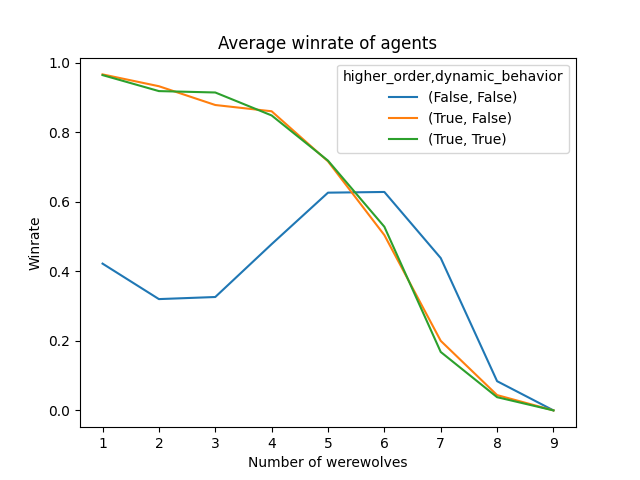
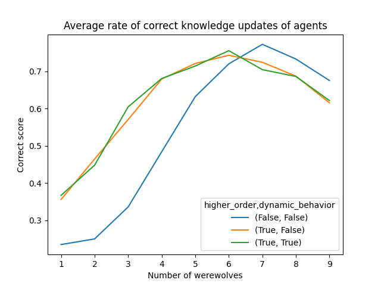
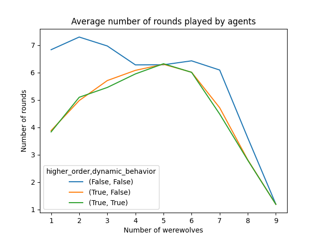

<head>
<link rel="stylesheet" href="https://cdn.jsdelivr.net/npm/katex@0.10.2/dist/katex.min.css" integrity="sha384-yFRtMMDnQtDRO8rLpMIKrtPCD5jdktao2TV19YiZYWMDkUR5GQZR/NOVTdquEx1j" crossorigin="anonymous">

</head>

# Logical Werewolves
Authors: Maurits Merks, Sander Venema, Maarten van der Velde

## Introduction
The Werewolves of Miller's Hollow is a popular social deduction game that challenges a player's ability to deceive other players, as well as deduce their role based on their actions and communication. The game consists of two factions: werewolves and villagers. The goal of these factions is to outmaneuver and eliminate members of the opposing faction in a battle for control over the village. Werewolves know each other, and can vote to eliminate a villager each night. Villagers on the other hand do not know who the other villagers or werewolves are. Each day, everyone can vote together on who to eliminate. Once an agent has been killed it is announced what the role of the agent was, and then everybody can draw their conclusions. 

Since the game revolves about gathering and deducing information, it is nicely suited for a formalization using higher-order logic. In this project, we simulate knowledge in order to play a simplified Werewolves of Miller's Hollow game. Multiple experiments are run and formally represented, offering a view into multiple ways for the agent to use knowledge to play the game. 

## Simplifications
The real game has multiple roles like the mayor, the hunter or the witch. Due to the complexity in implementing the knowledge updates for all the roles, we have chosen to reduce the game to simply three roles: werewolves, villagers and the little girl. The little girl was chosen specifically because she has the ability to peek during the night and discover who the werewolves are. This is an interesting property as it allows to introduce additional knowledge in the game, since the villagers have no way of truly knowing who the werewolves are until they are dead. By adding the little girl, villagers know that someone knows something about the werewolves, which makes the game more interesting. 

## Agents
The basic agent is initialized with the following items:
- A unique ID to identify the agent
- The total number of agents $$m$$
- The beliefs of the agent $$B_m$$

Additionally, each agent has access to a set of custom methods
- create_beliefs: generates a list with random beliefs of size $$m$$ about the other agents. Reliability of other agents is randomly generated where reliability score $$r_m \in [-1, 0, 1]$$.
- tie_argmin: takes as input a dictionary of beliefs, returns the ID of the agent with the lowest reliability score for agent $$m$$. In case of ties, returns a random ID from the list of lowest reliability scores. 
- tie_argmax: takes as input a dictionary of beliefs, returns the ID of the agent with the highest reliability score for agent $$m$$. In case of ties, returns a random ID from the list of highest reliability scores.

### Werewolf
A werewolf agent inherits from the basic agent, and has the following additions:
- Sets the beliefs about itself to $$-1000000$$ to avoid suicide or self-voting
- A vote method that returns the value from tie_argmax

### Villager
A villager agent inherits from the basic agent, and has the following additions:
- Sets the beliefs about itself to $$+1000000$$ to avoid self-voting
- A vote method that returns the value from tie_argmin

### Little girl
A little girl agent inherits from the basic agent, and has the following additions:
- Sets the beliefs about itself to $$+1000000$$ to avoid self-voting
- A discovery probability $$p_{sw}$$ that regulates the chance that the little girl spots a werewolf during the night
- A vote method that returns the value from tie_argmin
- A look_overnight method that allows the little girl to peak at the werewolves during the night with the discovery probability. If the little girl spots a werewolf, the beliefs about this werewolf are set to $$-100000$$ such that the girl will always vote for this werewolf after spotting them

## Formal model
The formal model of our simulation is as follows:
 - a set of $$m$$ agents $$A =$$ \{ $$a_1, a_2, ..., a_m$$ \}.
 - a set of $$x$$ werewolves, $$W \subset A$$, $$|W| = x$$.
 - a set of $$y$$ villagers, $$V \subset A$$, $$|V| = y$$.
 - a singleton set for the little girl, $$L \subset V$$, $$|L| = 1$$.
 - a set of propositions $$P =$$ \{ $$w_1, w_2, ..., w_m, l_1, l_2, ..., l_m$$ \}, where:
    - $$w_i = t$$ iff $$a_i \in W$$
    - $$l_i = t$$ iff $$a_i \in L$$
 - sets $$W$$ and $$V$$ are mutually exclusive, $$W \cap V = \emptyset$$,\
 hence for some $$a_i \in A$$, iff $$w_i = f$$ then $$a_i \in V$$
 - a set of reliability scores $$Rs =$$ \{ $$r_1, r_2, ..., r_m$$ \}.

After every phase, the agent $$a_i$$ that was killed or voted off is removed from $$A$$.\
Then a truthful public announcement is done about $$w_i$$ and $$l_i$$ and the reliablity scores $$Rs$$ are updated according to $$w_i$$.\
All $$a_j \in A$$ that voted to remove $$a_i$$ get $$r_j = r_j + 1$$ if $$w_j = t$$, and $$r_j = r_j - 1$$ if $$w_j = f$$.

In all states:
 - every $$a_i \in W$$ knows $$w_j$$ for all $$a_j \in A$$.
 - every $$a_i \in L$$ knows $$l_j$$ for all $$a_j \in A$$.

In at least one state:
 - every $$a_i \in L$$ knows $$w_j$$ for all $$a_j \in A$$.
 - iff not $$L=\emptyset$$, every $$a_i \in W$$ considers possible $$l_j$$ for $$a_j \in A$$ with $$max(Rs)$$
 - every $$a_i \in V \setminus{L}$$ considers possible $$w_j$$ for $$a_j \in A$$ with $$min(Rs)$$

Our Kripke model is defined as follows:
$$M ::= \langle S, \pi, R_1, ..., R_m \rangle$$, with:
 - $$S = $$tbd
 - $$\pi (s_i)(w_j) = t$$ iff $$a_j \in W$$
 - $$\pi (s_i)(l_j) = t$$ iff $$a_j \in L$$
 - $$R = $$tbd

## Implementation Details

### Initialization
Each agent has a set of beliefs that indicate how much an agent trusts another agent. These values are initizialized randomly with values -1, 0 or 1. This was done to induce small biases and randomness in the trust that agents have for each other. The agents do not have any reliability score about themselves, and werewolves also do not have any reliability about the other werewolves since they never vote for each other. 

### Night Phase
The game starts with the night phase. In the night phase, the werewolves vote for the agent with the highest reliability score. Typically, the agent with the highest reliability score is the agent that votes for werewolves during the day so it is advantageous for the werewolves to eliminate that agent. If there is a tie in the werewolf vote, a random agent is chosen between the options with the most votes. 
During the night, the little girl is given a chance to peek and try to find who the werewolves are. Each night, the little girl is given a .2 probability of discovering a werewolf. If see discovers a werewolf, she adds that werewolf to a list of known werewolves. 

At the end of the night, once the werewolves have killed a villager, a public announcement is made. This public announcement contains the role of the person that has just been killed. In the first round, nothing is done with this information since public vote has taken place. In the later rounds, the procedure is as follows: since additional information has been introduced in the game, the agents now update their beliefs. The agents now look at the votes from the day, and identify the agents that voted for the killed agent. The werewolves always kill a villager during the night, this means that the agents who voted for this agent to be killed are less trustworthy. Therefore, all agents substract 4 from their reliability score of the agents who voted for the villager. 

### Day Phase

Having updated their knowledge about the kill overnight, the agents must now vote who to kill during the day. The votings happens iteratively, meaning that the agents vote one after the other. The voting order is shuffled each round so that no bias is introduced by the voting order. After each vote, all the other agents have a chance to update their knowledge. The agents vote for the person with the lowest reliability score. Three different methods updating knowledge have been implemented: vote without higher order knowledge, update using higher order knowledge, and update using dynamic behavior. 

#### Update without using higher order knowledge

Agents don't update their beliefs during the iterative voting. This is because they do not consider what other agents know and vote. Knowledge is only updated after a public announcement. 

#### Update using higher order knowledge

In the scenario where higher order is used to update during the iterative voting, the agents take the votes of other agents in account to update their own beliefs. In this scenario, after an agent votes, all the other agents update their knowledge as follows: if the agent has been voted on, they retaliate with a certain probability. This probability increases throughout the rounds, as we want the agent to acknowledge that they know less in the beginning of the game. If the agent retaliates, it means they know that the other agent knows something about them and wants them out of the game. Therefore, if a villager or little girl retaliates, they update the reliablity of that agent to be the new lowest one. That is, the agent updates the trust in that agent to the minimum trust -1. If the retaliating agent is a werewolf, the reliability is increased to the maxmium +1, so that the werewolf votes for that agent during the night. 

If an agent has not been voted on, the manner in which they update their beliefs is dependent on their class. 
- For villagers, if agent has voted for the agent they consider to be the little girl, they consider that person to be a werewolf by setting the reliability of that agent to a new minimum. The same is done to the agent that the agent considered as the little girl votes for.
- For werewolves, if a werewolf votes for an agent, they will consider that agent to be the little girl.
- The little girl first considers if she has spotted all the werewolves. If she has not spotted all of them, there are multiple options: if the voter is a werewolf, the votee will be considered as a villager and vice-versa. If the little girl knows about neither the voter or the votee if they are a werewolf, she will consider it for the person she trusts the least to be a werewolf. 

#### Dynamic knowledge

We call dynamic knowledge the process of anticipating the outcome of the vote and changing our beliefs and vote to possibly influence it or not. When updating their knowledge dynamically, the agents act as follows: 
For each cast vote, we have:
- If the agent is a little girl or a werewolf and have not yet voted but are the target of the vote, the goal is to not stand out. This is because the agents now know that an agent knows something about them. To do this, they keep track of the votes so far, and update to not vote for the predicted winner based on the current votes they have access to. 
- If the agent is a regular villager and has not voted but are target of the vote or an agent that has already voted, they will retaliate with a probability epsilon, similarly to updating using higher order knowledge.
- If an agent has not been voted on, they update their current belief using the knowledge introduced by the vote. This done depending on the type of agent, as explained in the update using higher order knowledge section. 

After all agents are voted, the votes are counted. If there is a tie, a random choice is performed between the agents with the most votes. Next, another public announcement is made. Namely, that another agent has been killed, and their role. Again, the agents get a chance to update their knowledge based on the public announcement. This is done in a similar fashion as overnight, except this time the killed person can also be a werewolf. The knowledge update procedure is now as follows: 
- The agents look at the votes that have been performed, and look at who has voted for the killed agent
- If that agent is a werewolf , they increase their trust in the agents agents who have voted by 4, since they have voted as a villager should have.
- However, they voted to kill a villager, the trust in them is decreased by 4

This process is then repeated until there are as much villagers are werewolves, or there are no werewolves left. 

## Experiment
To assess the behaviour of our agents, we implemented several different experiments. The following variables were controlled during these experiments:
- The number of werewolves (1-9);
- The total number of agents (20);
- Whether higher-order knowledge was used;
- Whether dynamic behaviour was used.

The total number of agents was set to 20 to achieve a simple yet representatively large setup. The number of villagers was determined by the total number of agents - the number of werewolves - 1 to account for the little girl. The maximum number of werewolves was set to half of the total number of agents. This was decided since in our implementation the werewolves automatically win once they outnumber the villagers, since at this point the werewolves can win by both voting during the day and killing at night.

For each individual experiment, 500 games were run to obtain representative results. The setup was executed with and without higher-order knowledge. Moreover, we tested combinations of higher-order knowledge with and without dynamic behaviour. Each of these configurations was then evaluated with an increasing number of werewolves to analyze the impact of werewolf quantity on the behaviour of our agents.

Specifically, the behavioural statistics that we keep track of are the average winrate of the villagers, the average rate of correct knowledge updates and the average length of the games that were played. Since there were in total 27 settings that we compared, the total number of games played is 13500.

## Results
The first statistic we recorded is the average winrate that the agents obtained with an increasing number of werewolves. The results can be seen in figure 2 below. The first feature that can be observed is that the winrate with no higher-order knowledge starts low at around 0.4 with one werewolf, increases slightly to around 0.7 for six werewolves, and then quickly goes down as the number of werewolves approaches 9. With higher-order knowledge enabled, the winrate starts much higher, and goes down more smoothly as the number of werewolves increases. This is also the case for the setting with dynamic behaviour enabled.

|  |
|:--:|
| Figure 2: the average winrate of the agents as the number of werewolves increases.|

The second statistic we recorded is the average rate of correct knowledge updates for the agents with an increasing number of werewolves. The results can be seen in figure 3 below. The main observation here is that the rate of correct knowledge updates follows more ore less the same path, but that for higher-order knowledge, the rate of correct knowledge update increases much earlier. Again, this is also the case for the setting with dynamic behaviour enabled.

|  |
|:--:|
| Figure 3: the average rate of correct knowledge updates for the agents as the number of werewolves increases.|

Lastly, we recorded the average game length with an increasing number of werewolves. The results can be seen in figure 4 below. First we see that the average number of rounds per game is initially much lower with higher-order knowledge enabled. This can also be reflected by the average winrate from figure 2. From around 5 werewolves, however, the number of rounds seems to follow about the same path down for both the settings with and without higher-order knowledge. Again, this is also the case for the setting with dynamic behaviour enabled.

|  |
|:--:|
| Figure 4: the average length of the rounds as the number of werewolves increases.|

## Discussion
### Winrate
In the winrate, we clearly observe that the agents with higher-order knowledge perform better than the agents without higher-order knowledge. For a lower number of werewolves, the winrate is always about 2 to 3 times the winrate of the agents that do not use higher-order knowledge. This is a good example of why it is useful for the agents to know what order agents voted for, and what this means for their reliability. The agents clearly make good use of this knowledge to win the game. However, the use of dynamic behaviour did not seem to have any effect on the winrate.

### Knowledge updates
In the average rate of correct knowledge updates, we also see the benefit of using higher-order knowledge. Clearly, the agents that use higher-order knowledge make use of this knowledge to quickly and more efficiently update their beliefs about other agents. This is reflected in the generally higher correct score as the number of werewolves increases. However, the use of dynamic behaviour did not seem to have any effect on the average rate of correct knowledge updates.

### Round length
Lastly, in the average round length we again see the benefit of using higher-order knowledge. As is also represented in the winrate of these agents, the rounds are much shorter for a lower number of werewolves when agents use higher-order knowledge. It is clear that the agents already make use of their higher-order knowledge about other agents such that they can already vote out the werewolves in an early stage. For a higher number of werewolves, the difference disappears more or less. Again, the use of dynamic behaviour did not seem to have any effect on the average round length of the games.

### Overall
Interestingly enough, as the number of werewolves increases, the agents that do not use higher-order knowledge seem to outperform the agents that do use higher-order knowledge when it comes to winrate and rate of correct knowledge updates. This may be the result of a sort of 'overfitting' that the higher-order knowledge agents develop as the number of werewolves increases.

Lastly, despite our efforts to include a form of dynamic behaviour into the agents, there seems to be no observable difference in the outcomes of the experiments. It could for future research be investigated what parameters could make a difference here, and whether dynamic behaviour could possibly be augmented to overcome the overfitting effect that higher-order knowledge agents seem to have with a high number of werewolves.
