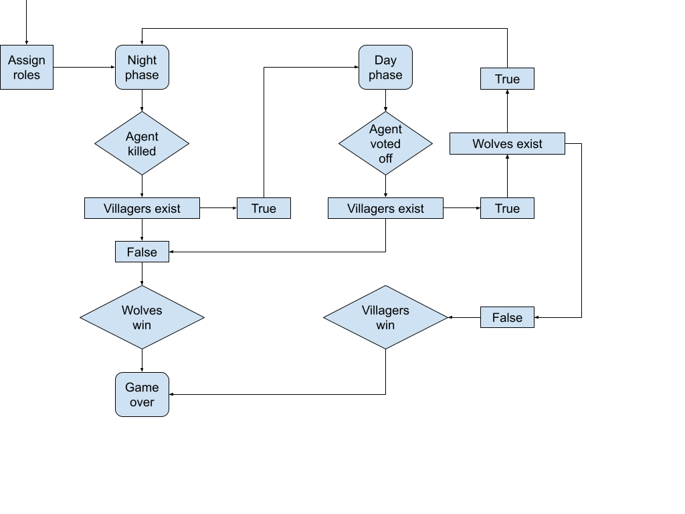

<head>
<link rel="stylesheet" href="https://cdn.jsdelivr.net/npm/katex@0.10.2/dist/katex.min.css" integrity="sha384-yFRtMMDnQtDRO8rLpMIKrtPCD5jdktao2TV19YiZYWMDkUR5GQZR/NOVTdquEx1j" crossorigin="anonymous">

</head>

# Logical Werewolves

## The Game
We initialize the game with $$x$$ werewolves and $$y$$ villagers, therefore
the total number of agents is $$m=x+y$$. One villager is set to be the
little girl, who can see the werewolves with a probability $$p_{sw}$$.
Additionally, every agent $$a$$ has a reliability score $$r_a$$. The game
has two phases: the day and night phase. The phases follow each other
consecutively, starting from the night phase. The game ends when the amount of werewolves becomes equal to the amount of villagers, or when the villagers have voted away all werewolves.

### Night phase
During the night phase, the werewolfs vote which villager they should kill. Voting happens based on the beliefs that each werewolf has in the sense that they always vote for the agent they deem the most reliable. The little girl can spot the werewolfs during the night, and additionally the werewolves can spot the little girl peeking during the night. 

### Day phase
During the day phase all agents vote on an agent to vote off. Each werewolf will vote for the villager that has the highest reliability score in their own beliefs. Villagers and the little girl will always vote for the agent with the lowest reliability score in their own beliefs.

|  |
|:--:|
| Figure 1: a flowchart of the game The Werewolves of Millers Hollow |

## Agents
The basic agent is initialized with the following items:
- A unique ID to identify the agent
- The total number of agents $$m$$
- The beliefs of the agent $$B_m$$

Additionally, each agent has access to a set of custom methods
- create_beliefs: generates a list with random beliefs of size $$m$$ about the other agents. Reliability of other agents is randomly generated where reliability score $$r_m \in [-1, 0, 1]$$.
- tie_argmin: takes as input a dictionary of beliefs, returns the ID of the agent with the lowest reliability score for agent $$m$$. In case of ties, returns a random ID from the list of lowest reliability scores. 
- tie_argmax: takes as input a dictionary of beliefs, returns the ID of the agent with the highest reliability score for agent $$m$$. In case of ties, returns a random ID from the list of highest reliability scores.

### Werewolf
A werewolf agent inherits from the basic agent, and has the following additions:
- Sets the beliefs about itself to $$-1000000$$ to avoid suicide or self-voting
- A vote method that returns the value from tie_argmax

### Villager
A villager agent inherits from the basic agent, and has the following additions:
- Sets the beliefs about itself to $$+1000000$$ to avoid self-voting
- A vote method that returns the value from tie_argmin

### Little girl
A little girl agent inherits from the basic agent, and has the following additions:
- Sets the beliefs about itself to $$+1000000$$ to avoid self-voting
- A discovery probability $$p_{sw}$$ that regulates the chance that the little girl spots a werewolf during the night
- A vote method that returns the value from tie_argmin
- A look_overnight method that allows the little girl to peak at the werewolves during the night with the discovery probability. If the little girl spots a werewolf, the beliefs about this werewolf are set to $$-100000$$ such that the girl will always vote for this werewolf after spotting them

## Formal model
The formal model of our simulation is as follows:
 - a set of $$m$$ agents $$A =$$ \{ $$a_1, a_2, ..., a_m$$ \}.
 - a set of $$x$$ werewolves, $$W \subset A$$, $$|W| = x$$.
 - a set of $$y$$ villagers, $$V \subset A$$, $$|V| = y$$.
 - a singleton set for the little girl, $$L \subset V$$, $$|L| = 1$$.
 - a set of propositions $$P =$$ \{ $$w_1, w_2, ..., w_m, l_1, l_2, ..., l_m$$ \}, where:
    - $$w_i = t$$ iff $$a_i \in W$$
    - $$l_i = t$$ iff $$a_i \in L$$
 - sets $$W$$ and $$V$$ are mutually exclusive, $$W \cap V = \emptyset$$,\
 hence for some $$a_i \in A$$, iff $$w_i = f$$ then $$a_i \in V$$
 - a set of reliability scores $$Rs =$$ \{ $$r_1, r_2, ..., r_m$$ \}.

After every phase, the agent $$a_i$$ that was killed or voted off is removed from $$A$$.\
Then a truthful public announcement is done about $$w_i$$ and $$l_i$$ and the reliablity scores $$Rs$$ are updated according to $$w_i$$.\
All $$a_j \in A$$ that voted to remove $$a_i$$ get $$r_j = r_j + 1$$ if $$w_j = t$$, and $$r_j = r_j - 1$$ if $$w_j = f$$.

In all states:
 - every $$a_i \in W$$ knows $$w_j$$ for all $$a_j \in A$$.
 - every $$a_i \in L$$ knows $$l_j$$ for all $$a_j \in A$$.

In at least one state:
 - every $$a_i \in L$$ knows $$w_j$$ for all $$a_j \in A$$.
 - iff not $$L=\emptyset$$, every $$a_i \in W$$ considers possible $$l_j$$ for $$a_j \in A$$ with $$max(Rs)$$
 - every $$a_i \in V \setminus{L}$$ considers possible $$w_j$$ for $$a_j \in A$$ with $$min(Rs)$$

Our Kripke model is defined as follows:
$$M ::= \langle S, \pi, R_1, ..., R_m \rangle$$, with:
 - $$S = $$tbd
 - $$\pi (s_i)(w_j) = t$$ iff $$a_j \in W$$
 - $$\pi (s_i)(l_j) = t$$ iff $$a_j \in L$$
 - $$R = $$tbd

## Implementation Details

### Initialization
Each agent has a set of beliefs that indicate how much an agent trusts another agent. These values are initizialized randomly with values -1, 0 or 1. This was done to induce small biases in the trust that agents have for each other. The trust for all villagers themselves was put at 1000000 so that they don't vote for themselves. Similarly, werewolves are initialized with a -1000000 reliability score about themselves but also about the other werewolves. This is because the werewolves know the other werewolves and generally do not vote against each other. 

### Night Phase
The game starts with the night phase. In the night phase, the werewolves vote for the agent with the highest reliability score. Typically, the agent with the highest reliability score is the agent that votes for werewolves during the day so it is advantageous for the werewolves to eliminate that agent. If there is a tie in the werewolf vote, a random agent is chosen between the options with the most votes. 
During the night, the little girl is given a chance to peek and try to find who the werewolves are. Each night, the little girl is given a .2 probability of discovering a werewolf. If see discovers a werewolf, she sets the reliability score of that werewolf to -100000. 

At the end of the night, once the werewolves have killed a villager, a public announcement is made. This public announcement contains the role of the person that has just been killed. In the first round, nothing is done with this information. In the later rounds, the procedure is as follows: since additional information has been introduced in the game, the agents now update their beliefs. The agents now look at the votes from the day, and identify the agents that voted for the kill agent. The werewolves always kill a villager during the night, this means that the agents who voted for this agent to be killed are less trustworthy. Therefore, all agents substract 4 from their reliability score of the agents who voted for the villager. 

### Day Phase
